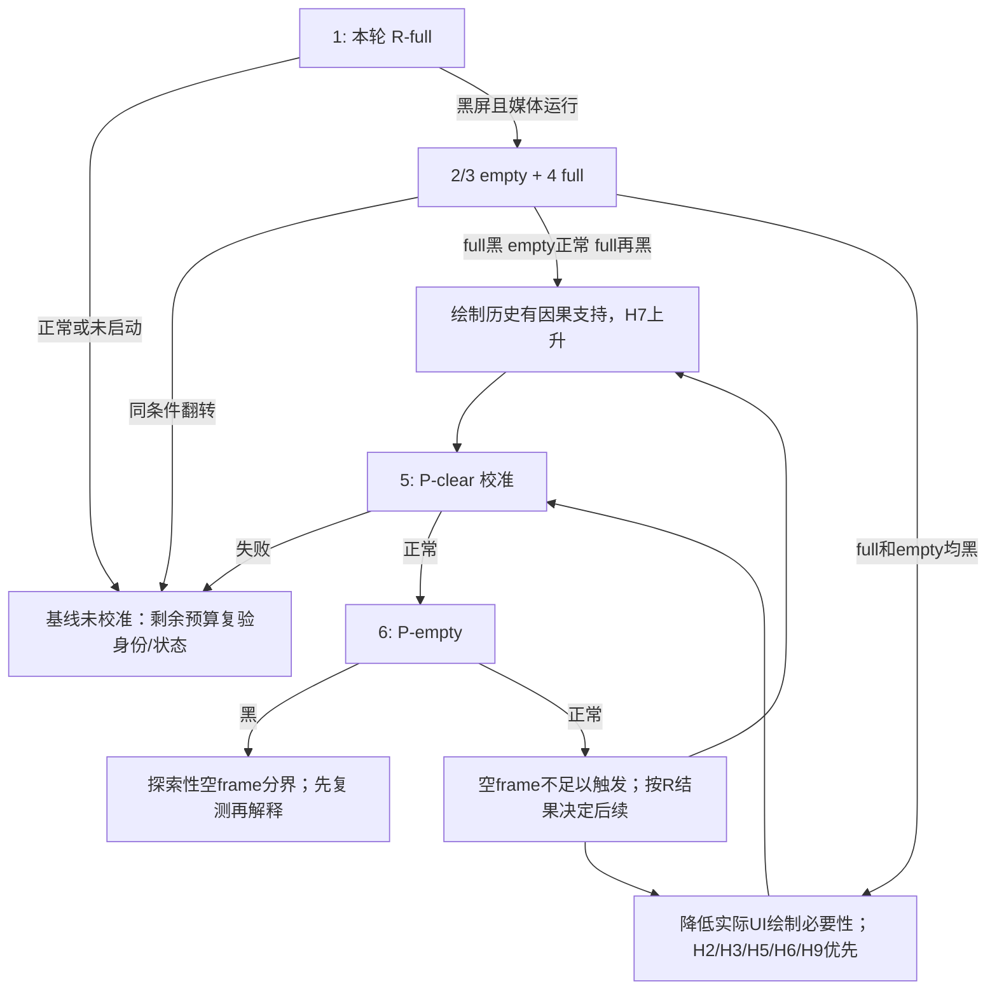

# E7 Black Screen Root-Cause Audit

> 状态：第一阶段证据审计；不是修复或设备验收
> 审计截点：2026-09-05，产品 `v1.2.0` / `fc9a0ea` 加接手时已有的未提交 E7 诊断
> 本页是第一阶段快照；六次及 C1/C2 之后的当前判断见[重新评估](E7_BLACK_SCREEN_REASSESSMENT_ZH.md)。
> 本页保存证据解释；真机事实与 Evidence Ledger 只在[设备矩阵](../../reference/DEVICE_TEST_MATRIX.md#e7-evidence-ledger)维护。
> 实验操作以[诊断方案](../../reference/E7_BLACK_SCREEN_DIAGNOSTIC_PLAN_ZH.md#e7-six-observations)为准；当前产品结构以[播放器架构](../../developer/PLAYBACK_ARCHITECTURE_ZH.md)为准。

## 1. Executive Summary

**根因尚未定位。已足以否定的是若干“单一充分条件”，不是它们参与交互的可能性。**
E7 的成功 Qt 视频参照与真实主程序环境中的失败均有证据；相同诊断包后来改变结果，要求模型
同时解释进程内历史、设备/服务状态和视频输出建立过程。不能把探针通过直接算作正式播放器通过。

本次审计有五项会改变下一步工作的方法性发现：

1. **日志文件不是独立实验。** 多个 `run-*.jsonl` 是累计 bridge 日志的不同截点，含其他 PID、
   旧错误和重连后重新从零开始的主机 `ms`。按文件数量统计重复，或取全文件最大的 position，
   都会混入别的实验。账本按启动 job、PID、变体和行范围归属；可见性仍来自用户记录。
2. **不能把重启安放到结果翻转之间。** OSID `36489 → 748` 出现在小 atlas 与首次 256 之间；
   首次 256 仍是失败观察。其后的 128、192、224、240、255、257、256 复测在同一个连续 bridge
   计时段内顺序运行。用户报告“9:49 前关过机”不等于已证明这次关机使 256 恢复。
3. **当前 R1/R1C 是真实首页加最小 Qt 视频宿主。** 它们保留真实 UI 初始化，但跳过网络、
   正式 VideoPlayerWidget、原生 MMF backend、preflight 和 FFmpeg。失败支持主程序环境差异；
   不证明正式 MMF 与 Qt Mobility 在同一内部阶段失败。
4. **外层窗口不是全部绑定对象。** 成功探针日志已出现内部 `S60VideoWidget`，其早期位置/可见性
   随后发生改变。Qt 4.8.0 源码又明确在 QGL resize 时重建 EGLSurface。保持 C++ 对象和最终
   geometry 不等于保持原生 surface 或绑定历史。
5. **`MvpuoFrameReady` 不是被动首帧事件。** SDK 契约是回应 `GetFrameL()` 的取帧请求。
   当前没有同一黑屏 MMF 会话的 decoded-picture、renderer 接收或 display-completion 证据。

工作模型为：

```text
进程内初始化/真实绘制/窗口历史 I
              × 设备与共享服务的未观测状态 Z
              × 绑定、surface 与事件循环顺序 T
              → 视频链在某个尚未观测的边界停滞或不可见
```

完整应用可能每次通过相似 I/T 把系统带入失败状态；最小探针只在部分 Z/I/T 组合进入该状态。
这是可证伪的工作模型，尚不能认定它一定是一个共同驱动 bug；两条媒体链也可能各有问题。

## 2. Stable Facts

以下均限定于账本中对应设备、样本、构建与运行方式。

| 支持的事实 | 强度与限制 |
|---|---|
| E7 有可工作的应用内 Qt 视频路径，QGL 初始化也可共存 | **STRONG EVIDENCE**：目视运动画面/声音加运行日志；不据此命名实际硬件 decoder |
| R1/R1C 的黑屏可以同时伴随媒体时间推进、音视频 available | **FACT**：日志状态；**STRONG EVIDENCE**：黑屏目视报告；有效视频帧输出仍 UNKNOWN |
| 同一 256、默认 NanoVG 包对应的后续观察发生翻转 | **STRONG EVIDENCE**：留存包/EXE 哈希重算、安装/启动记录、变体和用户反馈相互支持；缺少每次手机 EXE 读回 |
| 小/大 QGL 的局部重复有区分力，但不足以固定普遍尺寸规律 | **STRONG EVIDENCE**：当时配对重复；两个不同 EXE、设备状态未完全记录 |
| 半宽、先大后小、顶层 QGL、fullscreen 往返、clear、YUV 初始资源和字体注册均有成功反例 | **STRONG EVIDENCE** 或单次 **WEAK EVIDENCE**，按账本区分；这些动作不是各自独立的充分失败条件 |
| E7 本轮 Qt/Mobility 包版本与最低 SDK 版本不同 | **FACT**：CODA 运行库/安装包查询；包版本未确定设备插件的源码提交或编译宏 |
| 没有对应 N8 的本轮成功/失败逐次原始链 | **UNKNOWN**：不能把 E7 的归因、修复或成功泛化给 N8 |

“稳定黑屏”是当前样本中的重复性描述，不是对全部启动状态测得的失败概率。
普通 v1.2.0、完整 Qt 集成、R1C、独立 Player 是不同观察对象，报告中始终分别指认。

## 3. Invalidated Conclusions

| 旧判断 | 审计结论 | 反例或缺口 |
|---|---|---|
| E7 根本不能播放样本 A | **INVALIDATED** | 冻结 R0 与后续 Qt 参照有连续画面 |
| E7 的 QGL 与视频绝对互斥 | **INVALIDATED** | QGL-first Qt 参照、MMF 可见后创建 QGL等；不否定某些顺序有问题 |
| 大 QGL 是普遍根因，缩小就能修真实应用 | **INVALIDATED**（普遍命题） | R1C 缩半仍黑；多个先大后小探针正常；原小/大局部关联保留 |
| 只有 QGL 与宿主 rect 完全相等才会黑 | **INVALIDATED**（必要条件命题） | 留一像素仍黑，已反对“只有完全覆盖才失败”；这不单独证伪完全覆盖是否为某条件下的充分触发因素 |
| NanoVG 初始化是无条件根因 | **INVALIDATED** | 默认原包后续恢复；初始化作为状态相关触发因素仍保留 |
| 同二进制 NanoVG skip/init 已多次重复证明 | **不被原始记录支持** | NC 能归属的是一对；两对 C/N 使用不同包，不能混算成 NC 重复 |
| 256 是特异边界或“超过某面积就失败” | **INVALIDATED** | 同一 256 后续正常；257 成功；默认 512 也恢复 |
| 显存不足已定位 | **HYPOTHESIS**，不是事实 | 无预算、峰值、失败分配或强可重复压力证据；非单调与同包翻转反对简单总量阈值 |
| UI 留下 GLES state 已定位 | **HYPOTHESIS**，当前 Low | 尚无实际 frame/draw 的双向受控分界，也未证明视频在同一个 GLES context 内绘制 |
| activeWindow 为空/不是宿主就是根因 | **INVALIDATED**（充分条件） | 成功 R0W-S/T 也为空；R1B 的调用没有保持，不能据其失败彻底排除焦点时序 |
| endpoint 警告就是错误原因 | **INVALIDATED**（充分条件） | 成功和失败都有同一警告 |
| 媒体时钟/available 证明有效视频已交给 renderer | **INVALIDATED**（证据推断） | 它们只到控制/轨道层，黑屏组未捕获有效视频帧 |
| MIRROR 失败证明延迟绑定无效 | **INVALIDATED**（证伪用途） | 未证实完整启动，且调用顺序不与冻结参照相同 |
| MMF display-first 已排除提前绑定 | **不成立** | `b678b97` 仅 NewL、解析 native RWindow、WS Flush；没有提前 AddDisplayWindowL 或 surface 注册 |
| 重启/重置 CODA 已解释翻转 | **HYPOTHESIS** | OSID 跳变在首次 256 失败之前；没有可把关机放在成功翻转点的证据 |

历史“下一步继续尺寸二分”的文字仅为当时推断，已由当前诊断方案明确停止。
并非删除不利观察；撤回的是从观察到机制的越界推论。

## 4. Evidence Conflicts

| 冲突 | 可以保留的解释 | 尚不能排除的混杂 |
|---|---|---|
| 相同 NanoVG/atlas 包先黑后有画 | 存在包以外或运行路径历史的变化 | 前序程序、进程退出方式、重连、安装、共享驱动状态、分配顺序 |
| 探针半宽正常，真实 R1C 半宽黑 | 最终宽度没有概括真实 UI 与 native 历史 | PNG、字形上传、CJK 加载阶段、窗口树、定时器、首次 native 化、帧提交次数 |
| 资源逐项加入仍正常，真实 UI 仍黑 | 资源存在与资源使用不同；也可能关键差异不在 NanoVG | 累加实验与真实程序没有形成完全匹配环境，单次通过只能反对“单独充分” |
| MMF-first 可见后加 GL 正常，NewL/open-first 不恢复 | 后续 prepare/绑定/首帧/显示状态可能关键 | 旧 NewL/display-first 用独立定时器，非回调屏障；5500 ms 加 GL 也不是源码首帧门 |
| 同样 track/status，目视却不同 | 控制层指标不足以观察视频链 | 解码未出帧、renderer 未交接、surface 未显示三者均可能 |

有两个容易被忽略的来源混杂：

- 旧 Qt landscape 与新 window probe 使用同一个 UID `0xE000B153`，但 EXE 名称不同。
  UID/包版本不能唯一命名实验；这里只确认源码身份复用，不假定已经造成安装残留。
- 构建脚本把 probe 源码复制进各自 build 目录，但共用 SDK 的同名 target 输出；NanoVG C/backend
  仍从产品树编译。留存 `ProbeController.cpp` 哈希不是全体依赖快照，旧源码文件不能单独证明旧 EXE。

## 5. Hidden-State Candidates

| 未控量 | 已有线索 | 状态与下一项最小记录 |
|---|---|---|
| QGL EGLSurface 重建次数、native window 代次 | Qt Symbian resize/WinIdChange 源码；先大后小实验 | 有机制依据，未测真机：记录已有 context/surface/window 身份和事件顺序 |
| Window Server 背景 surface、alpha、ordinal、clipping | S60VideoWidget、Qt native 透明度/绘制路径 | 有机制依据，未测 region：outer/inner/group 分别记录，勿把 QWidget visible 当有效可见区域 |
| MMF utility/controller/renderer 与绑定代次 | 正式 backend 在 OpenComplete 绑定；两个 Mobility 源码版本有不同策略 | 设备内部调用 UNKNOWN：记录实际 utility 类型、controller、window 参数/返回码 |
| GPU/driver/global heap 与分配历史 | 同包翻转；资源组合相关性 | **HYPOTHESIS**：先记录分配返回、尺寸与资源存活量，进程 heap 不是 GPU budget |
| 前序进程是否完全退出、退出是否正常 | CODA 工具多次使用 `Processes.terminate` | 主机可观察：结束确认、剩余进程、正常 quit 与强制终止分别记；不能假定析构执行 |
| CODA session 与共享库停顿 | 重连、sessionEnd、启动 Shared Library suspend/resume | 有记录，作用未证：保留 job/connection/PID/resume；不把重连当 reboot |
| 启动序号与设备 boot | OSID 跳变、用户关机报告 | boot-id/uptime UNKNOWN；不可由 OSID 推出某次确切重启 |
| GUI 事件顺序和日志同步成本 | 主程序 100 ms startup、250 ms metrics、R1 100 ms readiness；probe 400/500 ms 阶段 | 当前代码差异确定；是否致因 UNKNOWN。记录 post/dispatch 序号及最后实际 swap |
| CJK 完成时点、PNG 与字形上传 | R1 ready 不要求 CJK 完成；loadUiResources 在绘制前已上传 PNG | 当前代码差异确定；不要把“没画首页”等价成“没上传图片” |
| 主 QGL 是否被后续事件重新 current | R0W-I doneCurrent 后、媒体创建前又 current 而仍正常 | 已有反例；只能否定“current 即必黑”，不证明 GPU 完工 |
| 滑盖、起始方向、补丁状态、安装盘 | 部分由纪要声明未变，缺单次记录 | UNKNOWN 项留空，不作已控制字段 |
| 样本身份/旧实验运行库 | 当前样本哈希和运行库已查询，历史仅路径 | 当前可固定；不能反向给旧包补运行库、SPS 或安装结果 |

## 6. Competing Hypotheses

置信度表示目前“这个机制参与本故障”的证据强度，不是概率，也不是执行优先级。
没有机制达到 High。H5 虽缺正证据，仍因区分价值高而必须观测。

| 模型 | Supporting evidence | Contradicting evidence | Missing evidence | Confidence |
|---|---|---|---|---|
| **H1 GL state contamination** | 非空 NanoVG flush 改 blend/stencil/texture 等；真实应用确实绘制 | 空初始化可以正常；已成功的独立 native 视频通常不消费应用 GLES 状态；缺跨 context 机制 | 同包真实绘制差分；实际 renderer/context；一次精确状态恢复的可逆结果 | Low |
| **H2 EGL/native surface handoff** | resize 重建 surface，原生视频和 EGL 都涉及 RWindow/WS；真实和探针历史不同 | 小探针的大尺寸/fullscreen/顶层历史也可正常 | 相同 run 的 surface 代次、inner RWindow、background surface、实际可见区 | Medium |
| **H3 MMF display-window binding timing** | 内层 widget 后续才稳定；正式/Qt 的 prepare/绑定顺序不同；pending 与 Show/WinIdChange 相连 | 参照相同宏观创建顺序正常；旧预建窗口并未检验真实绑定屏障 | 真正 Add/SetDisplayWindow 的时间/参数/返回码及后续是否重绑 | Medium |
| **H4 allocation/fragmentation/shared state** | 同包翻转、资源组合可改变结果、强制结束历史 | 同时没有 OOM，简单面积单调模型被反例否定 | 失败分配、可用 budget、固定前序下压力/释放的可重复关系 | Low；“存在隐藏状态”的证据远强于“显存碎片”的证据 |
| **H5 没有产生/提交有效首视频帧** | 当前全部 available/clock 指标都允许此解释 | 样本在另一环境可播放，反对普遍不支持编码 | 同一黑屏 MMF session 的帧/renderer 接收/submit 证据 | Medium（未排除的分支） |
| **H6 race/event-loop** | queued native 化、媒体 deferred state、QGL resize/current、日志与调试停顿 | 没有实测的竞态时间窗口；稳定 UI 程序仍常失败 | 事件序号、swap 完成、native/window-ready 与真正绑定的相对顺序 | Medium |
| **H7 真实资源使用/加载阶段组合** | R0W-P 不请求字形、不上传 PNG、不加载完整 CJK；真实程序均有额外工作 | YUV、字体注册单独成功；并无哪项资源被单独定罪 | 保留初始化而改变 frame/draw；记录字体/PNG 创建与上传计数 | Medium |
| **H8 输出分支或 controller 差异** | 正式 resolver 与 Qt Helix 候选不同；Mobility 版本之间 surface 策略改变；endpoint 探测存在 | Qt 成功探针与 Qt 失败 R1 也可能共享同一 plugin；单独 DLL 不足解释二者 | 手机上的 MMF plugin 哈希/导入/符号、实际 output control 类与调用栈 | Low |
| **H9 native 背景/透明度/裁剪更新不完整** | `_q_DummyWindowSurface`、内部 S60VideoWidget、WinIdChange/background/ordinal 与 Qt backing store 交互有源码依据 | 半宽整幅正常不符合简单像素遮盖；没有真实 region/attach 失败证据 | background surface 与 opaque/alpha 状态、WS 层更新，仍须与 H5 分开 | Medium |

H1 的可行机制必须是：视频实际借用了受污染的同一个 GLES context，或底层驱动错误地把
context 局部状态泄漏到共享视频路径。若实际是原生 surface/DSA，普通 `GL_BLEND` 或
`GL_CURRENT_PROGRAM` 不能按 API 契约直接控制另一个视频 surface。需要新增证据证明这种越界。
H2/H3/H6/H9 可以同时成立；H7/H4 可以改变进入它们的条件，不必选成互斥故事。

## 7. Call-Chain Analysis

### 7.1 版本与源码归属

本地 SDK `Symbian3Qt474` 只含安装/开发头文件及库，没有完整设备 Qt/Mobility 源树。
CODA 查询证实运行版本与包版本，**未提供已加载 MMF plugin 的哈希、源码提交、编译宏或
controller 调用栈**。本轮不换手机运行库，也不向手机部署替代插件。

源码参照分三层，不能互换：

- 产品源码：`fc9a0ea`、历史诊断提交和接手工作树，能确定应用自己的调用。
- Qt `v4.8.0` 上游 tag：匹配已报告的版本号；本地旧缓存与重新读取的对应文件一致，
  仍未完成设备 QtGui/QtOpenGL DLL 与源码的二进制匹配。
- Mobility：官方仓库查询可定位 `v1.2.0`，未找到对应 `v1.2.2` tag；另固定比较提交
  `169da60c8f657b3b61309c0a570d296107181411`。后者包含 endpoint 与额外 surface 生命周期，
  只能作为不同实现的对照，绝不称作 E7 的 1.2.2 源码。

可在下一轮同一次启动中记录 `QMediaService`/输出 control 的类名，查询实际已加载模块的
路径、UID/版本、大小/哈希、导入表与可用符号。仅有 EXE 的 Shared Library 停顿不等于已列出
全部 DLL。再据真实导入/反汇编确认 Utility2、AddDisplayL、AddDisplayWindowL 或 legacy DSA
入口；符号不能匹配时标记 UNAVAILABLE，不套用网上地址下断点。

### 7.2 Qt Multimedia / MMF 链

```text
QMediaPlayer（service/control）
  → setVideoOutput(QVideoWidget)
  → QVideoWidget 申请 widget/window/renderer control
  → S60VideoWidgetControl → S60VideoWidgetDisplay → 内部 S60VideoWidget
  → setMedia / service 根据输入建立 S60VideoPlayerSession
  → OpenFileL / OpenComplete → Prepare / PrepareComplete
  → 按版本和宏设置 display window / surface
  → Play → controller → decoder/renderer → WS（最后三段尚未在 E7 观测）
```

`new QMediaPlayer` 与 native `CVideoPlayerUtility::NewL` 不必同一时刻。
v1.2.0 service 在 video session 被请求时才创建 `S60VideoPlayerSession`；因此“先激活宿主再创建
QMediaPlayer”并不能证明 utility 在那一刻绑定了该宿主。
[service 源码](https://github.com/qtproject/qt-mobility/blob/v1.2.0/plugins/multimedia/symbian/mmf/mediaplayer/s60mediaplayerservice.cpp)

v1.2.0 路径在 `VIDEOOUTPUT_GRAPHICS_SURFACES` 下用 Utility2，并在 prepare 成功后的
`applyPendingChanges(true)` 按 WindowHandle 调 AddDisplayWindowL；不使用 graphics surfaces
时是 legacy Utility，起初从 active/allWidgets 选窗口，随后 SetDisplayWindowL。
窗口 Show/WinIdChange/Resize 能触发后续更新，不能把该实现描述成“只绑定一次”。
[session 源码](https://github.com/qtproject/qt-mobility/blob/v1.2.0/plugins/multimedia/symbian/mmf/mediaplayer/s60videoplayersession.cpp)

固定比较版本则在 prepare 后增加 AddDisplayL/`MMMFSurfaceEventHandler` 和一个空区域 dummy
window，避免移除可见 window 时 MMF 销毁仍需交接给 EGL 的 surface；其 window 替换还改成
先成功 add 新窗口再 remove 旧窗口。**旧诊断中“Qt 就是 prepare 后 AddDisplayL”的描述只对
这一类实现有源码依据，不能无条件套到 v1.2.0 或 E7 二进制。**
[固定比较 session](https://github.com/qtproject/qt-mobility/blob/169da60c8f657b3b61309c0a570d296107181411/plugins/multimedia/symbian/mmf/mediaplayer/s60videoplayersession.cpp)

对应输出工厂可在构造时探测 EGL extensions，而 `QVideoWidgetControl` 仍能走普通 native
widget。因而 `eglCreateEndpointNOK not found` 与成功 native video 并不矛盾；日志支持存在
endpoint 探测代码，尚不足以确定整个 plugin 的版本/宏或实际播放是否使用 endpoint。
[输出工厂](https://github.com/qtproject/qt-mobility/blob/169da60c8f657b3b61309c0a570d296107181411/plugins/multimedia/symbian/videooutput/s60videooutputfactory.cpp)

内部 S60VideoWidget 的 `videoWinId()` 可能取自身或父控件 effective native ID；display 通过
`DrawableWindow()` 取 RWindow。`_q_DummyWindowSurface`、show/native 化后的子控件布局、
background color 与 ordinal 更新均在这层。现有 R1 日志缺少其子树，因此目前不能断言 R1 与
成功 probe 的实际绑定 native window 完全一致。
[widget display](https://github.com/qtproject/qt-mobility/blob/169da60c8f657b3b61309c0a570d296107181411/plugins/multimedia/symbian/videooutput/s60videowidgetdisplay.cpp)

正式应用则走
[VideoPlaybackBackend](../../../symbian/source/platform/video_playback_backend.cpp)：
持久 native host → utility NewL → 文件/URL Open → OpenComplete 中 AddDisplayWindowL 和
configureDisplay → Prepare → tracks/policy → Play。普通首次构建后端还会执行 decoder
枚举；这与只读 header preflight 是两个动作。它可以列为正式 backend 的独立候选，
**不能解释不经过该 backend 的 R1C**。既有诊断 CONFIG 不等于对应实验已经跑过。

### 7.3 QGL / EGL / Window Server 链

```text
WiliwiliWidget / QGLWidget
  → QGLContext chooseContext → QEglContext / EGLConfig / EGLContext
  → QEgl::nativeWindow → widget->winId()->DrawableWindow()
  → eglCreateWindowSurface（该 RWindow）
  → makeCurrent → initializeGL / resizeGL / paintGL
  → Qt glDraw 自动 swapBuffers → EGL swap

resize / 部分 native-ID 变化
  → doneCurrent（若相同 current）→ destroy EGLSurface → create EGLSurface
  → makeCurrent / resizeGL
```

[Qt Symbian QGL](https://github.com/qt/qt/blob/v4.8.0/src/opengl/qgl_symbian.cpp)、
[Symbian EGL nativeWindow](https://github.com/qt/qt/blob/v4.8.0/src/gui/egl/qegl_symbian.cpp)、
[QGL glDraw/event](https://github.com/qt/qt/blob/v4.8.0/src/opengl/qgl.cpp)

两个关键限制：`paintGL()` 返回先于 Qt 的自动 swap；`nvgEndFrame()` 更早，不能把它标记为
“最后 UI 提交完成”。`doneCurrent()` 只取消 current，不销毁 surface、不保证整个视频链就绪。
后续 expose/resize/update 又可以重新 current。普通 Qt render loop 也不保证每帧 doneCurrent。

Qt 的 Symbian QWidget 平台层还设置 RWindow extent/visible/ordinal、原生透明度和 backing
store；某些 alpha 更新会清除 raster UI 内容以露出 EGL 内容。上游 hasBCM2727 分支也会影响
默认多重采样选择，所以不能跨 603/E7 把相同 QGLFormat 请求当作相同 EGLConfig。
这些是待核验的交互机制，不是本次已捕获的驱动故障。
[QWidget Symbian](https://github.com/qt/qt/blob/v4.8.0/src/gui/kernel/qwidget_s60.cpp)

### 7.4 NanoVG / YUV 的实际边界

[产品 NanoVG core](../../../symbian/third_party/nanovg/nanovg.c) 的 `nvgBeginFrame` 重置 CPU state、
计数与 text-dirty，并调用保存 viewport 的 backend 回调；`nvgEndFrame` 按 dirty 刷字形纹理，
调用 renderFlush，并在需要时轮换 atlas。**未绘制、未扩 atlas 的空 frame 下 `ncalls==0`，
当前 GLES backend 不执行主要 GPU 提交。空 frame 仍必须独立测试，作为 CPU/frame housekeeping
与非空 submission 的边界。** 空 frame 若改变结果，先核验计数/历史/时序，不能直接宣称
空 flush 发出了 GL draw 或 swap。

[GLES2 backend](../../../symbian/third_party/nanovg/nanovg_gl.h) 的非空 flush 使用 shader、VBO、
attribute 0/1、纹理单元 0、blend/stencil，结束时清理一部分状态，并不完整恢复调用者 state。
它不设置 framebuffer 或 GL viewport。初始化含 dummy texture 和 `glFinish`；真正字形更新、
图片上传、geometry VBO 分配是不同阶段。单看初始化成功不能证明这些后续阶段成功。

[真实首页](../../../symbian/source/app/wiliwili_widget.cpp) 的 YUV 初始化创建 program/六个空纹理，
并非实际六张视频纹理上传。`loadUiResources` 在首页画图之前就注册字体并上传两张 PNG；
随后首页 draw 才触发字形使用。R1 readiness 不以 CJK 完成为门；probe P 连 CJK 加载都没有。
所以减法实验必须保留初始化并记录这些门，不能假装只删 geometry 就控制住全部副作用。

## 8. First-Frame Observability

| 层 | 最小证据/插桩点 | 能证明什么 | 当前 E7 能否取得 |
|---|---|---|---|
| C0 控制/轨道 | Open/Prepare 返回、Playing、PositionL、VideoEnabledL | 控制器状态/轨道声明/媒体时钟 | 已有；不是视频首帧 |
| W1 窗口绑定 | 实际 Set/AddDisplayWindow 进入/返回、window/group/extent/clip、surface ID | 提交了怎样的输出配置；返回成功只证明接受 | 自写 backend 易加稀疏日志；R1 必须进入匹配的 Mobility/MMF 插件，当前未知 |
| D1 解码器已启动 | 同一 controller 内 decoder Initialize/Start/提交计数 | 初始化与输入已开始 | 当前无；另开 DevVideo 只证明另一个会话 |
| D2 有效视频图 | 同一 session 的 picture-ready + 正确尺寸/PTS + 像素特征/CRC | 某张有效图已产生 | 当前无被动 hook；可先考虑一次 GetFrameL，边界如下 |
| R1 renderer 收到 | 同一 session 的 buffer ID/PTS 入队，或实际 endpoint READY + acquired image | producer/renderer 已有内容 | endpoint 警告下不假定可用；匹配 renderer 内部实现后才能选入口 |
| S1 surface 配置 | MmsehSurfaceCreated/Parameters/Remove 和 background/window 附着 | surface 存在/配置发生 | 若设备确实走该接口可插桩；创建本身不等于有像素 |
| S2 提交/显示完成 | renderer SubmitUpdate 及 surface-update completion / MvroBufferDisplayed | 对应 buffer 被显示系统处理/报告显示 | partner API/实现依赖，不是 QMediaPlayer 的通用回调；仍不能单独证明用户看到 |
| V1 用户可见 | 同次 PID 时间窗内连续运动画面（必要时屏摄） | 显示链最终结果 | 已有人工报告；普通黑色 screenshot 不足以否定 native 视频层 |

本地 SDK `epoc32/include/videoplayer.h` 的 `MVideoPlayerUtilityObserver::MvpuoFrameReady`
明确对应 `GetFrameL(TDisplayMode)`。可在已有黑屏会话稳定后，仅一次请求无 DRM 样本帧，记录
request/return/callback、尺寸、格式、是否全黑与抽样 CRC；**不能称作被动 first-presented-frame**。
GetFrame 可能单独触发解码/同步或改变播放状态，因此必须先记录取帧前的目视和状态；取得有效图
只反对“该会话完全不能取有效视频图”，不证明取帧前自然播放已解码，更不证明 renderer 已收到。
返回 `KErrNotSupported` 是“此观测方法不可用”，不是“decoder 没有帧”。

本地 Symbian 多媒体源码的 `MVideoRendererObserver::MvroBufferDisplayed` 与 EGL endpoint
`imageAvailable/acquireImage` 提供更接近 renderer 的观测候选；二者不是可随意注册到现有 MMF
会话的公共 tap。未验证 controller 使用它们之前，不植入猜测地址、不给插件替换包，也不改变
输出到 QAbstractVideoSurface 来冒充原 native 路径的观测。

下一轮至少落实外层 window/control 与 UI submission 两层日志；W1 内部日志和 D2/R1/S2 以
设备模块匹配为准。**本轮只完成源码/API 可观测性审计和离线日志工具，未取得新的手机帧数据。**

## 9. Top Six Experiments

六次指六次单独新进程观察，包含重复和控制；不是六组各做四次。实施细节在
[六次观察操作契约](../../reference/E7_BLACK_SCREEN_DIAGNOSTIC_PLAN_ZH.md#e7-six-observations)。
用两个各自固定的 EXE：保留正式 VideoPlayerWidget/native backend 的真实应用 R、成功 R0W-P
家族 P。R 内 full/empty 同包，P 内 clear/empty 同包；跨 R/P 的差异本身不是单因素。
R 沿用正常播放器窗口和横屏门槛，以诊断输入入口提供样本 A、固定既有强制 MMF 模式，不借用
R1C 的第二 Qt 宿主或缩半主页。这样直接检验目标播放器，但必须花第 1 次重新校准其黑屏，不能
把历史 R1C 结果补作这个基线。当前六次均为**计划，未构建、未执行**。

| 次数 / 实验 | 修改和固定条件 | 结果 A：正常运动画面意味着 | 结果 B：黑屏但媒体运行意味着 | 为什么优先 |
|---|---|---|---|---|
| **1 R-full** | 完整首页、正式播放器与窗口过程；样本 A、本地输入、既有强制 MMF 设置；无 sanitize | 黑屏基线本轮未校准，不能声称新开关治好 | 得到本轮正式播放器基线，仍区分 H5/H2/H3 | 防止拿昨天的失败或 Qt 诊断宿主当今天的控制 |
| **2 R-empty** | 保留原 paintGL/clear、全部资源加载与启动状态；仅实际 UI 区段变为空 begin/end，首次允许绘制时即生效 | H7/真实绘制历史上升；H1 只是子候选；H2/H4/H6 未排除 | “实际首页 draw 是必要条件”下降；PNG/CJK/窗口及 H5 仍在 | 先在真失败环境做减法，空 frame 被单列而未绕过 paintGL |
| **3 R-empty 重复** | 不安装/不重链接，结束并确认前进程消失，完全相同模式新进程 | 若 2 同样正常则支持重复；若 2 黑则提示隐藏状态，不能继续归因 | 若 2 同样黑则绘制必要性进一步下降；若 2 正常则分界不稳定 | 给最有价值的差分分配一次重复 |
| **4 R-full 反向** | 原 EXE 恢复完整首页，其他条件不变 | 若此前 full 黑而现在正常，ABA 因果关系不成立，转状态调查 | 若 1/4 黑而 2/3正常，得到 full→empty→empty→full 的 ABBA 证据 | 用反向控制检验“漂亮故事” |
| **5 P-clear 校准** | P 保持 YUV/NanoVG/字体驻留与既有 window cycle；paintGL 只 clear，无 NVG frame | 证明成功参照在经历 R 后仍成立 | P 参照失效，H4/H6/shared-state 上升；第 6 次用于同条件复验 | 把前序程序影响纳入双向比较 |
| **6 P-empty** | 仅在 5 成功且 R 对照有效时，同包加入无内容 begin/end，沿用既有 paint/swap 频率 | 若 R-empty仍黑，空 frame 非充分因素；优先 H2/H3/H5/H6/H9 | 找到空 frame 候选分界；需未来反向复测，单次不能确认根因 | 在成功 probe 做镜像加法，直接检查 frame housekeeping，避免先猜矩形/字体 |

启动未发生、无有效时间推进、错误/暂停、日志不属于目标 PID，均记 **INCONCLUSIVE**，不算
结果 B。每次也消耗预算，不能悄悄补跑。若第 1 次基线正常或 2/3 翻转，剩余次数只用于恢复
同条件参照和重复，停止向更多变量展开；不得借机追加第七次。

这六次无法同时覆盖 rectangle/text/image/近似首页、sanitize 分解和全部内部插桩的配对。
优先保住正式播放器环境 ABBA 与空 frame 镜像对照。P 的两次只有探索性强度；不会把它写成已完成 ABBA。
未来只有复测成立才进入首个非空绘制边界；本轮不生成一串新 SIS。

## 10. Decision Tree



图中的回到 C/D 是分析归类，不是重复执行测试的循环。六次硬上限不变。
若后续真实 clear/empty 稳定黑，而 P 在有界非空/文字/图片/近似首页中仍稳定正常，立即停止
NanoVG 参数研究，转实际 MMF first-frame、内层绑定与 native surface。无需“再找一个 atlas”。
若取帧前黑、取帧后正常，首先归为取帧干预改变状态的 H3/H6 候选，不能反推自然播放早已出帧。

## 11. Candidate Workarounds

以下都不实施为正式修复，不通过机型硬编码或 reset ritual 绕过证据门。

| Candidate | 准入证据 | 必须排除的替代解释/回归 |
|---|---|---|
| 精确 GL 状态恢复 | 同包完整 UI 后单组 state 恢复稳定改变结果；定位实际共享/受影响上下文 | flush/finish/doneCurrent/延时本身造成效果；下一帧 UI 状态缓存一致性 |
| 最后 UI swap 后有序交接 | 固定 surface/window 下，仅事件屏障或 current 交接改变结果 | 不能固定睡眠、隐去主页、创建另一套生命周期；仍保留 panes/映射 |
| native 窗口就绪后配置或重绑一次 | 真正绑定参数/时序错误被捕获，重绑同一持久 window 可逆恢复 | 不靠不断 remove/add 形成回退循环；验证同址不同代次与第二次进入 |
| 修正 inner video window 的 background/clip/ordinal 更新 | 已有帧与正确 submit，但 actual window 配置错误且精确更新可恢复 | 不以永久置顶或大量透明窗破坏控件/弹幕/返回 |
| 改资源加载顺序/减少峰值 | 测得某项分配或组合预算与结果的受控关系 | 不直接把 atlas 固定成 255/240，不删首页功能冒充修复 |
| 正式 MMF 与 Qt 兼容路径的有限适配 | 固定本地输入、controller/utility/display 差异被隔离 | 不能把诊断 Qt backend 或独立 Player 整批合入；需新的正式化 ADR |

源码还发现比较版 `applyPendingChanges` 有 `m_pendingChanges && Rotation` 这样的可疑布尔
条件，以及旧实现清 WindowHandle pending 的方式值得审阅。它们只列 **Candidate Fix**：
设备二进制未匹配、实际 flag 状态未采到，既不能先补 Nokia SDK，也不能从“看见可疑行”推导
黑屏原因。旧 display-first 的不足则是实验命名/设计问题，并不是产品修复。

sanitize 的具体可拆解诊断契约见诊断方案；它不占用上述六次之外的隐藏观察次数，也未编译进
当前普通包。

## 12. What Would Count as Fixed

1. 完整 NIKINIKI 保留正常首页、正常选源、正式播放功能。R1C 或纯 probe 出画只是研究通过。
2. 同一候选 Release SIS 在 E7 独立菜单启动可稳定出画；本地成功样本之外还覆盖真实用户输入，
   再验证完整下载/增长文件/远程输入及自动、强制 MMF、强制 FFmpeg。不得靠单向规则以外的循环重试。
3. 横屏先确认物理 640×360，再显示播放器；返回先物理 360×640 再恢复主 fullscreen。保留
   panes、主 QGL 映射、完整持久对象图与 640×360 视频/overlay/input 坐标。
4. 研究阶段至少 20 次进入/返回无崩溃才继续正式集成；正式验收仍须 50 次进出、MMF/软件交替、
   暂停/seek/倍速/画质/音量/弹幕/控制及至少 30 分钟前后台、内存和温度观察。
5. Nokia 603 同包回归通过。N8 必须独立收集型号、固件、运行库、逐样本与循环结果；E7 通过
   不能代替 N8，也不能泛化到所有初代 Symbian³。补丁只保持手动可选边界。
6. 静态检查、GCCE 编译、SIS 打包/签名、CODA 与 Release 独立启动分别记；唯一设备结果来源
   是设备矩阵，发布材料只在 releases。得到 workaround 可以验收，不要求先解释全部厂商驱动。

## 审计覆盖与可复核限制

已读取当前状态/路线图/播放器架构/设备矩阵/诊断方案，ADR-0001/2/3/4/5/8 和归档
ADR-0006/7；核对 E7 阶段归档、播放器生命周期/横屏/DSA/YUV/ref7 研究边界，当前正式/诊断
代码和历史 QWidget/QGL、NewL/display/open-first、Qt 集成、CONTROL/MIRROR 实验 diff。
并列研究仓库只作只读检索，不复制产品源码；现有独立 Player 构建残留不当作活源码。

当前日志、构建快照和 25 份留存诊断 manifest 的 EXE/SIS 都已做离线一致性核对；这些是
主机留存身份，不能补造旧设备逐次读回或真机通过。历史 E7-01～21 缺失的原始逐包运行日志、
N8 独立记录、设备已加载 plugin 身份仍明确 UNKNOWN。也没有日志支持将全部历史观察固定为
同一次 boot 或同一套运行库。

本轮新增[离线按 PID 取证工具](../../../tools/research/e7/summarize_coda_run.py)，防止累计日志
混算；它从不连接手机，不导出原始日志/端点，不把 available 变成 PASS。
原始日志、源码下载缓存、完整哈希和解析结果保留在本地忽略目录 `.tmp/e7-root-cause-audit/`。
验证：按 PID 重新提取 36 份有 TRACE 的运行记录与账本一致；另外两次 R0 采用原 QTMW/启动回执、
一次 Y 缺应用日志，均保留各自边界。离线工具 7 项测试通过；本轮所读 134 个既有 Symbian
源文件/配置快照哈希未变，文档链接与结构检查通过。
本轮没有修改正式播放逻辑、没有手机实验、没有 SIS 构建或发布。
